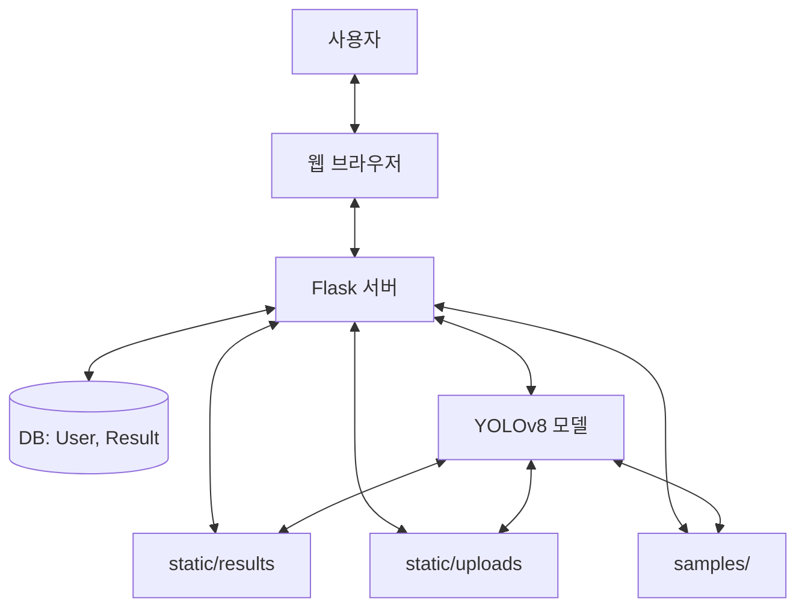

# 데이터 흐름 다이어그램

```mermaid
flowchart TD
    User["사용자"]
    Web["웹 브라우저"]
    Flask["Flask 서버"]
    DB[("DB: User, Result")]
    Uploads["static/uploads"]
    Results["static/results"]
    Samples["samples/"]
    YOLO["YOLOv8 모델"]

    User <--> Web
    Web <--> Flask
    Flask <--> DB
    Flask <--> YOLO
    Flask <--> Uploads
    Flask <--> Results
    Flask <--> Samples
    YOLO <--> Results
    YOLO <--> Uploads
    YOLO <--> Samples
```

-   사용자는 웹을 통해 파일 업로드/샘플 선택
-   Flask 서버가 파일 저장, YOLO 분석, 결과 저장/조회
-   DB에는 사용자/분석 결과 메타데이터 저장
-   결과 파일은 static/results에 저장됨
