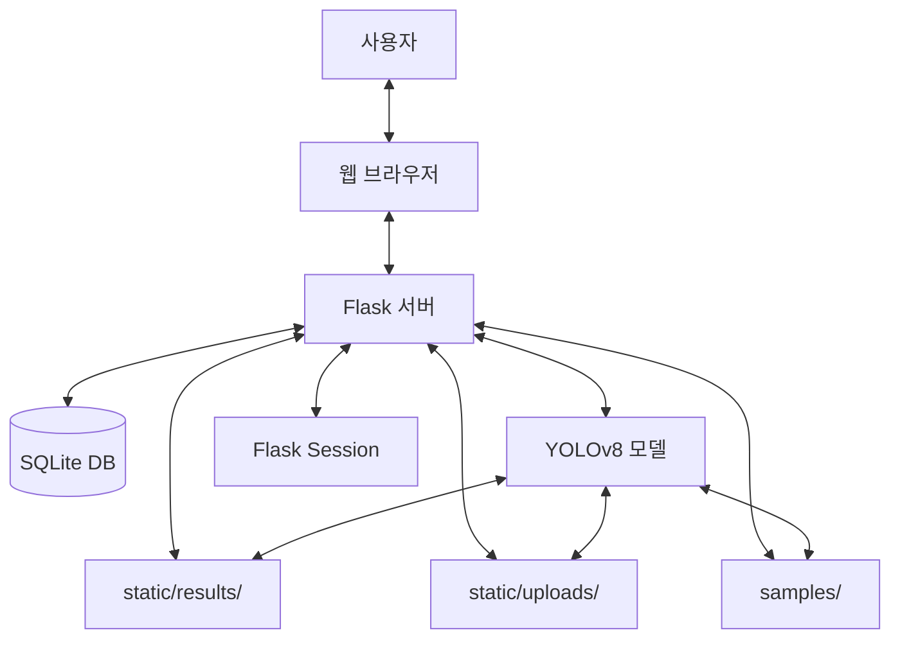
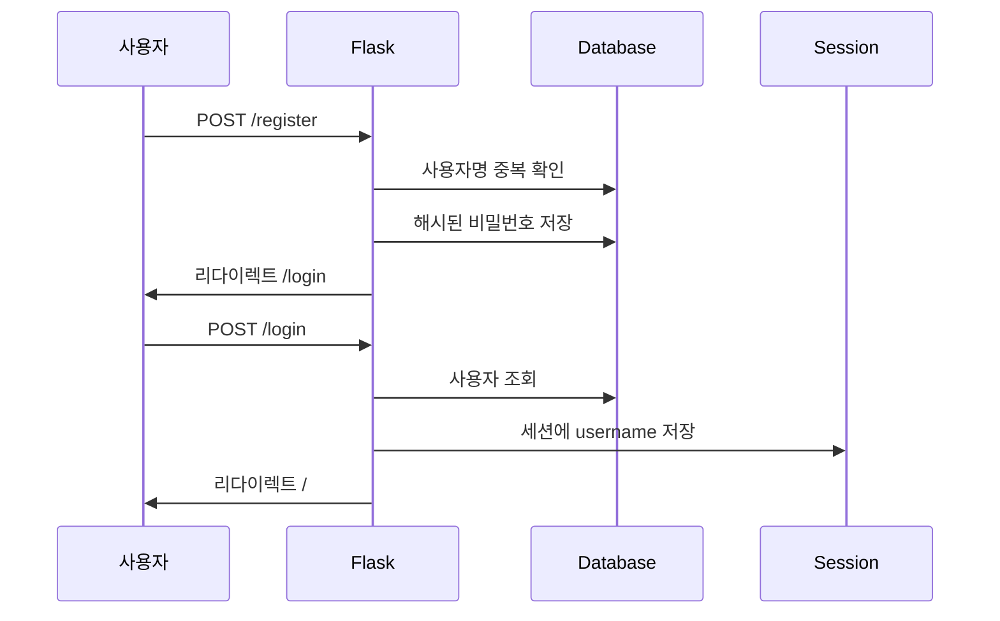
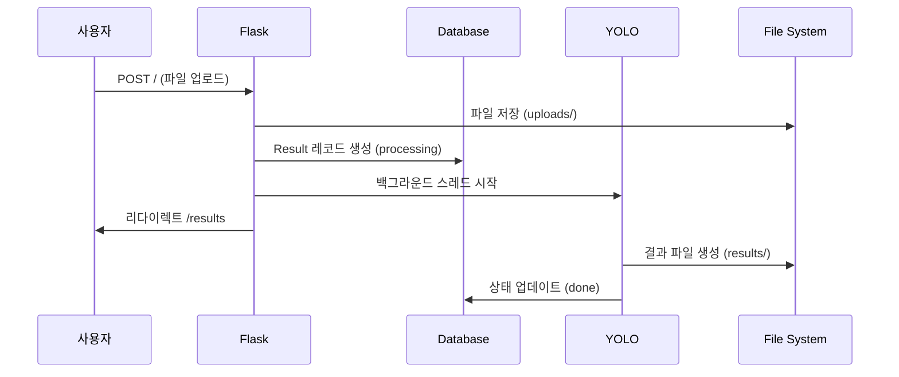
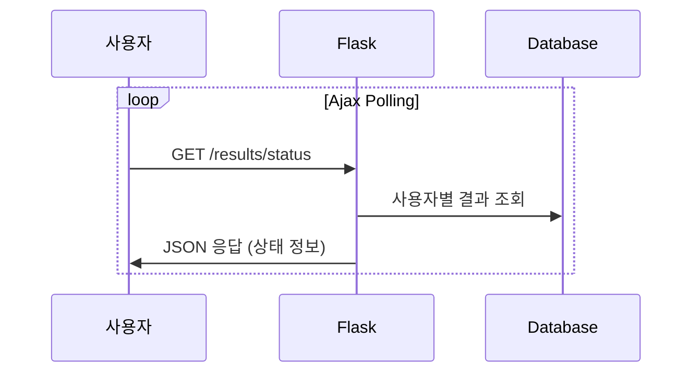

# 데이터 흐름 다이어그램

## 전체 시스템 아키텍처



## 상세 데이터 흐름

### 1. 사용자 인증 플로우



### 2. 파일 업로드 및 분석 플로우



### 3. 실시간 상태 확인 플로우



## 데이터 저장소 구조

### 데이터베이스 (SQLite: users.db)

#### User 테이블

| 필드     | 타입         | 설명            |
| -------- | ------------ | --------------- |
| id       | INTEGER      | 기본키          |
| username | VARCHAR(80)  | 고유 사용자명   |
| password | VARCHAR(200) | 해시된 비밀번호 |

#### Result 테이블

| 필드              | 타입         | 설명                              |
| ----------------- | ------------ | --------------------------------- |
| id                | INTEGER      | 기본키                            |
| username          | VARCHAR(80)  | 사용자명                          |
| original_filename | VARCHAR(200) | 원본 파일명                       |
| result_path       | VARCHAR(200) | 결과 파일 경로                    |
| result_type       | VARCHAR(20)  | 결과 타입 (image/video)           |
| result_ext        | VARCHAR(20)  | 결과 파일 확장자                  |
| status            | VARCHAR(20)  | 처리 상태 (processing/done/error) |
| timestamp         | DATETIME     | 생성 시간                         |

### 파일 시스템 구조

```
static/
├── uploads/          # 사용자 업로드 파일
│   └── [파일명]
├── results/          # YOLO 분석 결과
│   ├── [UUID].jpg    # 이미지 결과
│   └── [UUID]/       # 비디오 결과 폴더
│       └── predict/
│           └── [파일명]
└── css/
    └── style.css     # 스타일시트

samples/              # 샘플 파일
├── *.jpg            # 샘플 이미지
└── *.mp4            # 샘플 비디오

flask_session/        # 세션 파일
└── [세션ID]
```

## 데이터 처리 단계

### 1. 파일 검증

-   확장자 화이트리스트 확인 (jpg, jpeg, png, mp4, avi, mov)
-   파일명 보안 처리 (secure_filename)

### 2. 파일 저장

-   업로드 파일: `static/uploads/`
-   샘플 파일: `samples/`

### 3. YOLO 분석

-   **이미지**: 단일 결과 파일 생성
-   **비디오**: 프레임별 분석 후 비디오 생성

### 4. 결과 저장

-   결과 파일: `static/results/`
-   메타데이터: Result 테이블

### 5. 상태 관리

-   processing → done/error
-   실시간 Ajax polling으로 상태 확인

## 데이터 흐름 상세 분석

### 인증 데이터 흐름

1. **회원가입**

    ```
    사용자 입력 → Flask → DB 검증 → 해시화 → DB 저장
    ```

2. **로그인**

    ```
    사용자 입력 → Flask → DB 조회 → 해시 검증 → 세션 생성
    ```

3. **로그아웃**
    ```
    요청 → Flask → 세션 삭제 → 리다이렉트
    ```

### 파일 처리 데이터 흐름

1. **파일 업로드**

    ```
    파일 선택 → 확장자 검증 → 파일 저장 → DB 레코드 생성
    ```

2. **YOLO 분석**

    ```
    파일 경로 → YOLO 모델 → 결과 생성 → 파일 저장 → DB 상태 업데이트
    ```

3. **결과 조회**
    ```
    사용자 요청 → DB 조회 → 파일 경로 생성 → 템플릿 렌더링
    ```

### 실시간 데이터 흐름

1. **상태 확인**

    ```
    Ajax 요청 → DB 조회 → JSON 응답 → 프론트엔드 업데이트
    ```

2. **파일 다운로드**
    ```
    다운로드 요청 → 파일 경로 검증 → 파일 스트림 → 브라우저 다운로드
    ```

## 보안 데이터 흐름

### 비밀번호 보안

```
평문 비밀번호 → Werkzeug 해시화 → DB 저장
로그인 시도 → 해시 검증 → 세션 생성
```

### 파일 보안

```
업로드 파일 → secure_filename() → 확장자 검증 → 안전한 저장
```

### 세션 보안

```
로그인 성공 → 서버 측 세션 생성 → 파일시스템 저장
요청 시 → 세션 검증 → 접근 허용/거부
```

## 성능 최적화

### 비동기 처리

-   YOLO 분석을 백그라운드 스레드에서 실행
-   사용자 요청 응답 지연 방지

### 캐싱 전략

-   세션 데이터 파일시스템 캐싱
-   정적 파일 브라우저 캐싱

### 데이터베이스 최적화

-   인덱스: username, timestamp
-   쿼리 최적화: 사용자별 결과 조회
